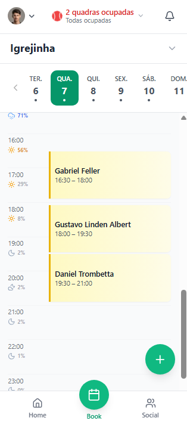
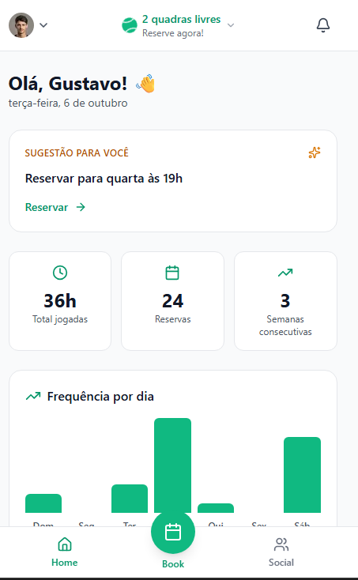
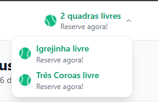
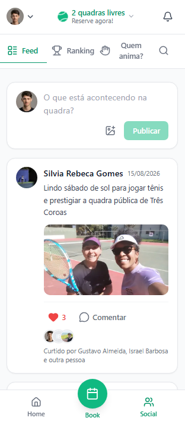
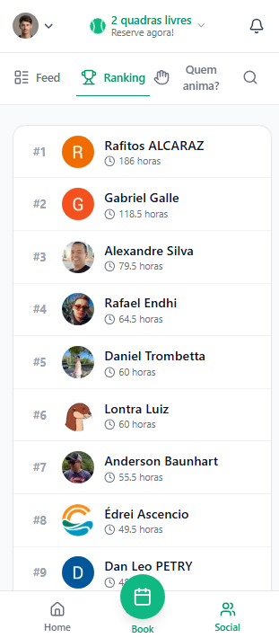
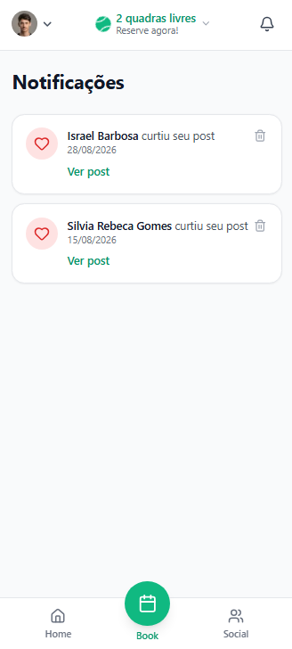

# QuadraLivre 🎾
### Plataforma de Gestão de Quadras Comunitárias, Agendamentos e Rede Social Esportiva

> **Case de Estudo & Projeto de Portfólio**  
> Desenvolvido de ponta a ponta por **Gustavo Almeida**  
> **Status:** Em produção | **Usuários ativos:** +200 tenistas | **Cobertura:** Igrejinha-RS e Três Coroas-RS

---

## 💡 O Contexto e o Problema Real

Quem pratica esportes em quadras públicas ou comunitárias conhece bem a dor: **o infame grupão de WhatsApp**.

Na região da Serra Gaúcha (Igrejinha e Três Coroas), a organização dos jogos dependia de mensagens soltas, listas de texto manuais e muita fricção. O resultado era frequente:
- **Conflitos de horário:** Dois jogadores marcavam a mesma hora sem perceber e descobriam a sobreposição na beira da quadra;
- **Mensagens perdidas:** Dúvidas sobre horários livres ficavam enterradas sob centenas de conversas;
- **Falta de previsibilidade:** Ninguém sabia em tempo real se a quadra estava liberada ou se as condições climáticas permitiam o jogo;
- **Isolamento de novos atletas:** Jogadores tinham dificuldade de encontrar parceiros com nível de jogo compatível para marcar treinos.

Identifiquei esse gargalo na minha própria rotina como tenista. Decidi então projetar e desenvolver o **QuadraLivre**: uma solução digital completa, mobile-first, desenhada sob medida para a dinâmica de atletas amadores, transformando a desorganização de um chat em um produto fluido, seguro e comunitário.

---

## 🛠️ Como eu Desenvolvi o Projeto

O QuadraLivre não foi construído como um exercício teórico ou clone genérico, mas como um produto real colocado em produção desde o primeiro dia. Cada decisão arquitetural e de interface foi guiada pela experiência do usuário em quadra:

### 1. Engenharia de Agendamento à Prova de Falhas
O maior desafio técnico de um sistema desse tipo é evitar *race conditions* e abusos de reservas. Implementei no backend (Next.js Route Handlers + Firebase Admin SDK) um motor de validação rigoroso com checagens atômicas:
- **Limite justo de ocupação:** Máximo de 1 reserva por dia por atleta e teto semanal para evitar monopolização das quadras públicas.
- **Janela de antecedência:** Agendamentos permitidos apenas em até 7 dias corridos.
- **Detecção atômica de sobreposição:** Verificação instantânea de conflitos de slots antes de qualquer escrita no banco de dados.

### 2. Integração com Dados Climáticos em Tempo Real
Tênis em quadra descoberta depende 100% do clima. Integrei o serviço de previsão hora a hora da **Open-Meteo**, mapeando coordenadas geográficas de cada quadra. Cada slot da agenda exibe a probabilidade de chuva e o ícone de tempo correspondente, permitindo que o atleta decida conscientemente o melhor horário para jogar. A camada de previsão conta com cache no cliente e tratamento resiliente de erros: oscilações na API externa nunca quebram o fluxo de agendamento.

### 3. Gamificação e Pré-Computação de Métricas
Para engajar a comunidade, criei um sistema de patentes (*Iniciante* a *Profissional*) calibrado em horas em quadra e um ranking geral. Para manter consultas rápidas e economizar custos de leitura no Firestore, implementei um **cron job diário** (`/api/cron/ranking`) que processa o histórico de partidas e grava um snapshot leve dos líderes. O cliente consome o dado pré-calculado, caindo para cálculo sob demanda apenas em caso de fallback.

### 4. Arquitetura Mobile-First e Social
Pensado primariamente para uso em smartphones com ergonomia de PWA: botões de ação ao alcance do polegar, navegação inferior limpa, feed interativo de fotos, comentários com menção (`@`) e central de notificações reativa via Firestore `onSnapshot`.

---

## 📸 Interface e Funcionalidades Principais

Abaixo estão as principais telas do sistema, detalhando a experiência de uso e a lógica aplicada em cada módulo.

---

### 1. Grade de Reservas e Agenda Interativa *(O Coração da Aplicação)*

A tela principal do produto foi projetada para funcionar como uma agenda viva e visual, eliminando o preenchimento de formulários burocráticos.

  

- **Navegação temporal contínua:** Seletor de dias da semana com indicadores em ponto (*dots*) nas datas que já possuem horários ocupados.
- **Visão horária em tempo real:** Cards claros identificando o jogador responsável pelo slot (ex.: 16:30 às 18:00, 18:00 às 19:30).
- **Previsão do tempo integrada:** Coluna esquerda com probabilidade de precipitação calculada para cada hora do dia, antecipando dias chuvosos.
- **Ação em um toque:** Botão flutuante de criação rápida (+) e seletor superior de cidade/quadra (Igrejinha / Três Coroas).

---

### 2. Dashboard Pessoal com Sugestões Inteligentes

Ao abrir o app, o usuário tem uma visão consolidada da sua jornada esportiva e atalhos contextuais.

  

- **Sugestão Inteligente:** Card de recomendação que analisa os dias e horários habituais do tenista e sugere a próxima reserva com um único clique (*"Reservar para quarta às 19h"*).
- **Métricas de evolução:** Total de horas jogadas na plataforma, número de reservas concluídas e sequência de semanas ativas (*streak* de consistência).
- **Gráfico de frequência:** Distribuição visual dos dias da semana em que o usuário mais costuma treinar.

---

### 3. Status das Quadras ao Vivo

Uma das maiores dores dos tenistas locais era ir até a quadra sem saber se ela estava ocupada no momento.

  

- **Indicador no topo da aplicação:** Pill dinâmica que monitora o momento atual e exibe imediatamente a situação geral (*"2 quadras livres"* / *"Todas ocupadas"*).
- **Menu contextual por localidade:** Dropdown rápido informando separadamente o status das quadras de Igrejinha e Três Coroas, permitindo reservas imediatas de última hora.

---

### 4. Feed da Comunidade e Interações Esportivas

O agendador evoluiu para uma verdadeira comunidade social esportiva da região.

  

- **Publicações com mídia:** Tenistas compartilham fotos de partidas, torneios e treinos do fim de semana.
- **Interações sociais:** Sistema de curtidas com listagem de avatares dos participantes e comentários com menções diretas a outros atletas.
- **Matchmaking ("Quem anima?"):** Aba dedicada a encontrar tenistas disponíveis para bater bola na mesma faixa de horário.

---

### 5. Ranking de Horas e Gamificação

Para incentivar a prática esportiva regular e movimentar a comunidade local, o app calcula a dedicação de cada atleta.

  

- **Tabela de classificação:** Contagem automática de horas em quadra calculada a partir de partidas confirmadas.
- **Arquitetura otimizada:** Alimentado por rotina agendada que gera cache consolidado, garantindo renderização instantânea mesmo com dezenas de competidores.

---

### 6. Central de Notificações em Tempo Real

Acompanhamento de interações e convites sem necessidade de recarregar a página.

  

- **Atualização viva (`onSnapshot`):** Notificações imediatas quando alguém curte uma postagem, comenta mencionando seu perfil ou envia um desafio de partida.
- **Ações diretas e limpeza:** Link para visualizar o post relacionado e opção de arquivamento individual.

---

## 💻 Stack Tecnológica

| Camada | Tecnologia | Motivação da Escolha |
|---|---|---|
| **Frontend** | Next.js 15 (App Router) + React 19 | SSR para SEO na landing, SPA reativa nas rotas autenticadas, server actions e route handlers. |
| **Linguagem** | TypeScript | Tipagem estrita de regras de negócio, horários, modelos de dados e permissões. |
| **Estilização** | Tailwind CSS | Design responsivo, paleta visual esportiva moderna e alta fidelidade mobile. |
| **Autenticação** | Firebase Auth | Fluxo Google One-Tap rápido e seguro para onboarding em segundos. |
| **Banco de Dados** | Cloud Firestore | Sincronização em tempo real de quadras, feeds e notificações via WebSockets/listeners. |
| **Regras / Backend** | Next.js Route Handlers + Firebase Admin | Camada com privilégios de serviço para validação anti-race-condition de reservas. |
| **Armazenamento** | Firebase Storage | Upload otimizado de fotos de perfil e imagens do feed social. |
| **E-mails Transacionais** | Brevo API | Notificações de confirmação de agendamento e convites de desafio. |
| **Meteorologia** | Open-Meteo API | Previsão climática precisa por coordenada geográfica sem atrito de autenticação. |

---

## 📈 Impacto e Resultados

- **100% de adesão na comunidade local:** A transição do WhatsApp para a plataforma foi completa entre os praticantes regulares da região.
- **Zero sobreposições de horários:** Conflitos e discussões de horário foram totalmente eliminados desde o lançamento.
- **Escalabilidade regional:** O sistema começou atendendo uma única quadra em Igrejinha e expandiu para Três Coroas e novos polos da serra.
- **Mais de 200 atletas ativos** interagindo, organizando torneios e marcando seus treinos de forma autônoma.

---

  Desenvolvido com 🎾 por <strong>Gustavo Almeida</strong>

